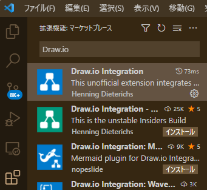
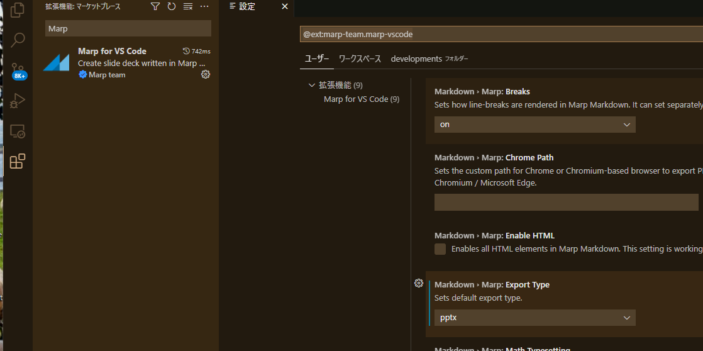

# Marp trial

---

## What's this

marp でスライドを作ってみた話を書いていく

---

### なんでそんなことを

普通に Google Slide や Power Point でいいのでは？
→既存のドキュメントをそのまま PPTX で欲しいという謎要望への対応

Google Docs で作っているドキュメントを PPTX に置換するのはそれなりに骨
→**マークダウンから Google Docs と同等のものと PPTX の双方を出力！**

---

### やることを図解するとどうなる？

こうなる。


---

## 導入手順

1. VS Code を入れる
2. VS Code に拡張機能 `Marp for VSCode` を入れる
3. (推奨) VS Code 拡張機能 `Draw.io Integration` を入れる
4. マークダウンファイルを編集する
5. 設定を適切に変更する
6. 出力する

---

### VS Code を入れる

割愛。
[こちら](https://azure.microsoft.com/ja-jp/products/visual-studio-code/)とかから導入

---

### 拡張機能を入れる(Marp for VSCode)

左のメニューから拡張機能を導入。


---

### 拡張機能を入れる(Draw.io Integration)

左のメニューから拡張機能を導入。
製図に便利なのでほしいなら。


---

### マークダウンファイルを編集する

[README.md](./README.md)みたいに編集する

---

#### マークダウンファイル編集の注意点1 先頭に挿入

先頭に以下の呪文を入れる必要あり

```
---
marp: true
---
```

---

#### マークダウンファイル編集の注意点2 改ページ

3つハイフンで改ページ

```
---
```

---

### Marp for VS Code の設定を変える

デフォルトだと PDF 出力なので吐かせ方を任意に変更
拡張機能の一覧から設定を開けるのでそちらから実施



---

### ビルドする

右上のサンドイッチめいたアイコンをクリック後、
Export Slide Deck... をクリック