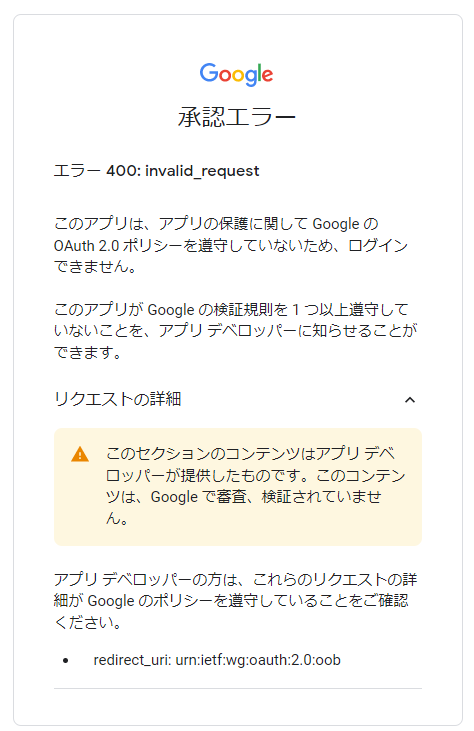

# md2googleslides trial

## 導入

### 導入ガイド

[https://github.com/googleworkspace/md2googleslides](https://github.com/googleworkspace/md2googleslides)
こちらにインストールガイドがあります。

なお、Node.js 16.14.2 で試しています。

### 重要な情報へのアクセスと言われてアクセスがブロックされた

[issue95](https://github.com/googleworkspace/md2googleslides/issues/95) を参考に対応を試みている。

#### clientId と clientSecret を書き換える？

[issue95](https://github.com/googleworkspace/md2googleslides/issues/95#issuecomment-858729913)にはそのような手順が提案されている。
これを試した所 "このアプリは、アプリの保護に関して Google の OAuth 2.0 ポリシーを遵守していないため、ログインできません。" と言われて不可。

ただ、これってアプリ側なのか API 周りの設定が悪いのかはまだ良くわかってない。