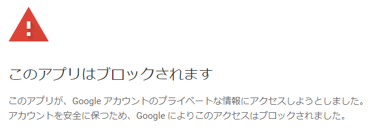

# md2googleslides trial

## 結論

多分このアプローチうまくいかないよ

## 導入

### 導入ガイド

[https://github.com/googleworkspace/md2googleslides](https://github.com/googleworkspace/md2googleslides)
こちらにインストールガイドがあります。

なお、Node.js 16.14.2 で試しています。

### 重要な情報へのアクセスと言われてアクセスがブロックされた

[issue95](https://github.com/googleworkspace/md2googleslides/issues/95) を参考に対応を試みている。

#### clientId と clientSecret を書き換える？

[issue95](https://github.com/googleworkspace/md2googleslides/issues/95#issuecomment-858729913)にはそのような手順が提案されている。
これを試した所 "このアプリは、アプリの保護に関して Google の OAuth 2.0 ポリシーを遵守していないため、ログインできません。" と言われて不可。

ただ、これってアプリ側なのか API 周りの設定が悪いのかはまだ良くわかってない。

### ソースコードが古いのでは

[issue95](https://github.com/googleworkspace/md2googleslides/issues/95#issuecomment-924181932)にソースコードが古い旨が書かれている。
ソースコードを clone した上で `npm run compile` してみた。`npm run compile` するにはいくらかのものをインストールする必要があるのでそれは注意が必要。

必要そうなものをインストールした上で実行した所
`Argument of type '() => Chai.Assertion' is not assignable to parameter of type 'ProvidesCallback | undefined'.` および
`Argument of type '() => Chai.PromisedAssertion' is not assignable to parameter of type 'ProvidesCallback | undefined'.` が大量に出て失敗する。

ないし、master ブランチの最新版を手動で適用するでも良いとのことだが、それだと上述の OAuth 2.0 ポリシーのアラートが発生して上手くいかなかった。

### アプリ側の問題では？

エラーメッセージは次のようになっている。

#### 日本語

> アプリ デベロッパーの方は、これらのリクエストの詳細が Google のポリシーを遵守していることをご確認ください。
> `redirect_uri: urn:ietf:wg:oauth:2.0:oob`

#### 英語

> If you’re the app developer, make sure that these request details comply with Google policies.
> `redirect_uri: urn:ietf:wg:oauth:2.0:oob`

[Google Developers Japan: セキュリティが強化された OAuth フローで Google OAuth インタラクションの安全性が向上](https://developers-jp.googleblog.com/2022/03/oauth-google-oauth.html) を見ると
"OAuth アウトオブバンド（OOB）フローが非推奨に" とある。このフローを使っているか否かを調べるには "アプリのコードか、外向きのネットワーク呼び出し（アプリで OAuth ライブラリを使っている場合）を調べ、アプリで行っている Google OAuth 認可リクエストの “redirect_uri” パラメータに次の値が含まれているかどうかを確認してください" とのこと。これは [auth.ts#L55](https://github.com/googleworkspace/md2googleslides/blob/928ef4ecb3f88c0d5ef3008a8e0f14e727ad54f8/src/auth.ts#L55) に存在した。

## 懸念点

### メンテされてなくね？

はい（はい）